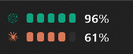

# Quota Blocks（个人修改版本）

这是基于 [NathanCheng685/quota-blocks](https://github.com/NathanCheng685/quota-blocks) 的个人 Windows 修改版本，用于在 Windows 任务栏快速查看 ChatGPT / Codex 和 Claude 的剩余额度。

本仓库主要记录针对个人 Windows 使用环境进行的界面和显示调整。原项目的版权、作者署名、资源和 MIT 许可证仍归 NathanCheng685 所有，本版本不主张拥有原项目的版权，也不改变原许可证要求。

## 当前修改

- 将额度显示适配到 Windows 任务栏，并避开系统小组件区域；
- 如果只安装 ChatGPT / Codex 或只安装 Claude，任务栏只显示已安装程序的额度；Claude 未安装或不可用时自动隐藏对应行；
- 调整详细面板的字体、图标大小、行距和面板宽度；
- 统一 ChatGPT / Codex 与 Claude 的标题和图标视觉尺寸；
- 将任务栏品牌 logo 改为白色，并采用类似手机电量的额度颜色显示；
- 保留中英文切换、开机自动启动、额度页面入口和退出功能；
- 增加中文说明、原程序与修改后效果对比及额度颜色配图。

## 额度颜色示例

- 80%～100%：绿色；
- 20%～79%：黄色；
- 0%～19%：红色。


## 效果对比

| 原程序任务栏效果 | 个人修改后任务栏效果 |
| --- | --- |
|  |  |

修改后的详细面板：


## 安装与使用

Windows 版本说明、安装方法和数据来源请查看 [Windows 中文说明](windows/README.md) 和 [完整中文修改总结](CUSTOMIZATION_SUMMARY.zh-CN.md)。

程序默认安装到：

```text
%LOCALAPPDATA%\Programs\QuotaBlocks
```

## 原项目与版权

- 原作者：[NathanCheng685](https://github.com/NathanCheng685)
- 原项目：[NathanCheng685/quota-blocks](https://github.com/NathanCheng685/quota-blocks)
- 许可证：[MIT License](LICENSE)

本项目与 OpenAI、ChatGPT、Anthropic 或 Claude 官方没有隶属、赞助或认可关系。相关名称和标志归其各自所有者所有。

## 隐私

程序在本地运行，没有服务器、分析、广告或遥测。详见 [PRIVACY.md](PRIVACY.md)。
