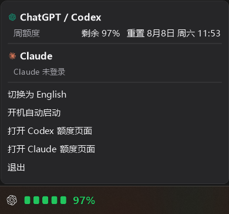

# Quota Blocks

See your remaining ChatGPT/Codex and Claude subscription quotas at a glance.

Quota Blocks is available for both desktop platforms:

| Platform | Surface | Source and installation |
| --- | --- | --- |
| **macOS 14+** | Two compact rows in the menu bar | [mac/](mac/) |
| **Windows 10/11** | Two compact rows in the bottom-left of the taskbar | [windows/](windows/) |

Both versions show five quota blocks plus the exact remaining percentage, refresh
automatically every two minutes, open a detailed bilingual panel, and support
launch at login.

> Quota Blocks is an independent, unofficial open-source project. It is not
> affiliated with, endorsed by, or sponsored by OpenAI or Anthropic.

## Privacy

Quota Blocks runs locally, has no server, analytics, ads, or telemetry, and
treats existing provider credentials as read-only. See [PRIVACY.md](PRIVACY.md).

## License

[MIT](LICENSE)
