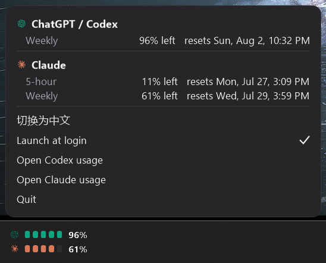

# Quota Blocks for Windows

A compact taskbar widget that shows how much ChatGPT/Codex and Claude subscription
quota you have left. Windows port of the macOS menu bar app in [the root of this
repository](../README.md); the two share their provider icons and their reading
of the same local sources.

Windows has no menu bar, so instead of a status item the app draws its two rows
directly onto the taskbar in the **bottom-left corner** — no panel, no border,
just the content. Each row is a provider icon, five blocks, and the remaining
weekly percentage. Click it for a panel with every window, reset times, and the
app's settings.

Percentages always mean **remaining** quota, not used.


| Details panel | English |
| --- | --- |
|  |  |

> Independent, unofficial project. Not affiliated with, endorsed by, or sponsored
> by OpenAI or Anthropic.

## What it reads

| Row | Source |
| --- | --- |
| **ChatGPT / Codex** | `codex.exe app-server` over stdio — the same JSON-RPC call the Codex desktop app makes. Reports the weekly window and its reset time. |
| **Claude** | Whichever local source is signed in, in this order: the Claude Code CLI's OAuth session, then the Claude desktop app's own usage log. |

### The two Claude sources

1. **Claude Code CLI** — `%USERPROFILE%\.claude\.credentials.json` plus Anthropic's
   usage endpoint. Gives the 5-hour session, weekly, and Fable limits *with*
   reset times. These credentials are treated as strictly read-only: Claude Code
   owns and rotates them, and this app never writes them.
2. **Claude desktop app** — `%APPDATA%\Claude\plan-usage-history.json`. No
   network and no credentials, but only the used percentages for the 5-hour and
   weekly windows, no reset times, and it only advances while the desktop app is
   running.

The app prefers (1) and silently falls back to (2) when the CLI's token is
missing or expired. On the fallback the panel says so, and says why the reset
times are absent — the desktop app's log simply does not record them, so there is
nothing to show rather than something that failed to parse:

```
来源：Claude 桌面版本地记录 · 07-27 00:13
该来源不含重置时间 · 运行 claude auth login 可恢复
```

Running `claude auth login` in a terminal restores the richer source; the app
switches back on its next refresh, no restart needed.

Nothing is ever sent anywhere except Anthropic's own usage endpoint, using
credentials that are already on the machine.

## Requirements

- Windows 10/11
- [.NET 8 Desktop Runtime](https://dotnet.microsoft.com/download/dotnet/8.0)
  (already present if you have the .NET 8 SDK)
- Codex / ChatGPT desktop app installed and signed in, for the Codex row
- Claude Code CLI or the Claude desktop app signed in, for the Claude row

## Install

From this `windows/` directory:

```powershell
.\scripts\install.ps1
```

This publishes into `%LOCALAPPDATA%\Programs\QuotaBlocks`, registers launch at
login, and starts the app. Re-run it to update in place.

Build without installing:

```powershell
dotnet build -c Release
```

Check the data path without the UI:

```powershell
.\bin\Release\net8.0-windows\QuotaBlocks.exe --probe
```

## Using it

- **Click the bar** — opens the details panel: every window with its remaining
  percentage and reset time, the data source, and the actions below.
- **切换为 English / 切换为中文** — language toggle, remembered in the registry.
- **开机自动启动** — launch at login, a `Run` entry under `HKCU`.
- **打开 Codex 额度页面** and **打开 Claude 额度页面** — open the provider usage pages.
- **退出** — quits. There is no tray icon; this is the only way out.
- Click anywhere else, or press `Esc`, to dismiss the panel.

The bar follows the taskbar itself: it stays on top of everything while the
taskbar is showing, and disappears whenever the taskbar does — under a fullscreen
window, or when an auto-hiding taskbar has slid away.

The app refreshes every 2 minutes. There is deliberately no manual refresh and no
way to reset a quota.

## Implementation notes

Both windows are layered (`UpdateLayeredWindow`) rather than ordinary WinForms
surfaces. That is what lets the bar have no background of its own and still
composite cleanly onto the taskbar, and what gives the panel antialiased rounded
corners over whatever is behind it. A few things that are easy to get wrong and
are worth keeping:

- The bitmap must be **premultiplied** before `UpdateLayeredWindow`; GDI+ hands
  back straight alpha, and the light theme blows out without the conversion.
- `WS_EX_TOPMOST` is applied in `CreateParams`, not via `Form.TopMost` — WinForms
  drops the style again when it re-applies bounds on a layered window.
- The bar uses `WS_EX_NOACTIVATE` so clicking it never steals focus, which means
  the `MouseClick` event does not fire; it overrides `OnMouseDown` instead.
- Because the bar never activates, this process is usually not the foreground
  one, and the panel's `Activate()` is refused — leaving it open with no
  `Deactivate` to dismiss it. `AttachThreadInput` to the current foreground
  thread first makes `SetForegroundWindow` legal. Even so, `Deactivate` is not
  trusted on its own: the panel installs a `WH_MOUSE_LL` hook while it is open
  and closes on any click outside its bounds, whatever the focus situation is.
- That hook runs on the UI thread's message loop, so blocking that thread would
  stall input machine-wide. The quota services `ConfigureAwait(false)` their way
  off it, which matters because the Codex reader waits on a child process as it
  tears down.
- The bar has no background, but a layered window passes clicks through any
  pixel with zero alpha, so it still fills itself with `alpha = 3` to stay
  clickable.
- Clicking the taskbar raises `Shell_TrayWnd` within the topmost band and the bar
  lives inside the taskbar's own rectangle, so it gets covered. A
  `SetWinEventHook(EVENT_SYSTEM_FOREGROUND)` re-asserts topmost immediately.
- Whether to show at all is read from the taskbar window's real position, not
  inferred from the working area — an auto-hidden taskbar slides off-screen and
  never gives the working area back. One test (is enough of the strip on screen
  to sit in?) covers auto-hide, a taskbar moved to another edge, and fullscreen
  windows alike, and the bar positions itself against that same rectangle.
- An `EVENT_OBJECT_LOCATIONCHANGE` hook **scoped to the taskbar's own thread**
  makes that immediate; unscoped it would be every window move on the system. A
  one-second timer re-evaluates as a backstop, which also recovers if explorer
  restarts and takes the hook with it.
- All metrics are authored at 96 dpi and scaled by `DeviceDpi / 96`, so the
  widget stays crisp at 150%/200% scaling.

Set `QUOTABLOCKS_LOG=1` to get a `quota-blocks.log` next to the executable.

## Attribution

The provider marks are embedded straight from `../mac/Sources/QuotaBlocks/Resources`
rather than copied, so the two ports cannot drift apart. The macOS app adapted
them from the MIT-licensed [CodexBar](https://github.com/steipete/CodexBar).
OpenAI, ChatGPT, Anthropic, Claude, and Fable are trademarks of their respective
owners.

## License

[MIT](../LICENSE), same as the rest of the repository.
